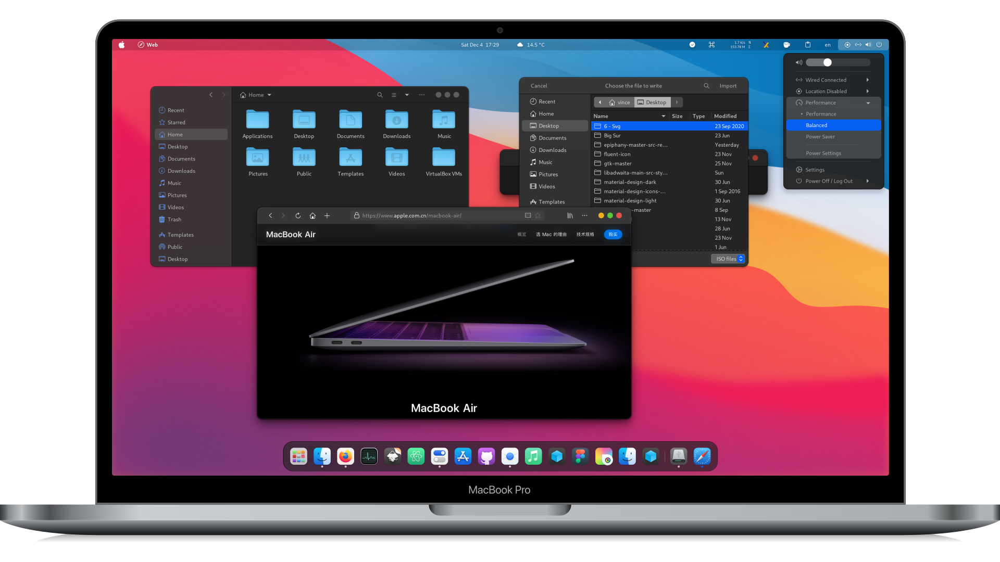

<h1 align="center">🍎 macify</h1>
<p align="center"><b>The macOS look for Ubuntu - one script.</b></p>
<p align="center">
  
  
  
  
  <a href="https://github.com/rockharshitmaurya/macify/stargazers"></a>
  
</p>

```
    ███╗   ███╗ █████╗  ██████╗██╗███████╗██╗   ██╗
    ████╗ ████║██╔══██╗██╔════╝██║██╔════╝╚██╗ ██╔╝
    ██╔████╔██║███████║██║     ██║█████╗   ╚████╔╝
    ██║╚██╔╝██║██╔══██║██║     ██║██╔══╝    ╚██╔╝
    ██║ ╚═╝ ██║██║  ██║╚██████╗██║██║        ██║
    ╚═╝     ╚═╝╚═╝  ╚═╝ ╚═════╝╚═╝╚═╝        ╚═╝
```

One command turns a stock Ubuntu desktop into a clean macOS-style setup -
themes, icons, cursors, dock and blur - with numbered progress steps,
colored output and a full log if anything goes wrong.

<p align="center">
  
  <br>
  <sub>Preview from the <a href="https://github.com/vinceliuice/WhiteSur-gtk-theme">WhiteSur theme</a> macify installs</sub>
</p>

Bundles existing projects - nothing reinvented:

- [WhiteSur GTK theme](https://github.com/vinceliuice/WhiteSur-gtk-theme)
- [WhiteSur icons](https://github.com/vinceliuice/WhiteSur-icon-theme)
- [WhiteSur cursors](https://github.com/vinceliuice/WhiteSur-cursors)
- [Extension Manager](https://github.com/mjakeman/extension-manager) (via apt)
- GNOME `user-theme` extension (via apt) for the shell theme
- [Dash to Dock](https://extensions.gnome.org/extension/307/dash-to-dock/) - macOS-style dock (bottom, centered, autohide)
- [Blur my Shell](https://extensions.gnome.org/extension/3193/blur-my-shell/) - macOS-style blur/translucency
- Extensions installed straight from extensions.gnome.org, matched to your GNOME version

## Install

Paste this in a terminal - that's it:

```bash
/bin/bash -c "$(curl -fsSL https://raw.githubusercontent.com/rockharshitmaurya/macify/main/install.sh)"
```

Or clone and run:

```bash
git clone https://github.com/rockharshitmaurya/macify.git
cd macify
./install.sh
```

Log out and back in when it finishes.

## What it changes

- GTK, icon, cursor and shell themes → WhiteSur Dark
- Window buttons → left side (close/min/max)
- Ubuntu dock disabled, Dash to Dock installed: bottom, centered, autohide, 48px icons
- Blur my Shell for panel/overview translucency

## Requirements

Ubuntu 22.04+ with GNOME. Run as a normal user (it uses `sudo` internally).

## Undo

```bash
gsettings reset org.gnome.desktop.interface gtk-theme
gsettings reset org.gnome.desktop.interface icon-theme
gsettings reset org.gnome.desktop.interface cursor-theme
gsettings reset org.gnome.desktop.wm.preferences button-layout
gsettings reset-recursively org.gnome.shell.extensions.dash-to-dock
gsettings reset org.gnome.shell.extensions.user-theme name
```
